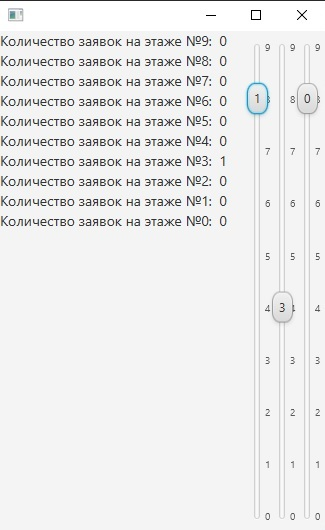

Лифты представлены в виде ползунков, где число в ползунке - количество пассажиров в лифте, а положение ползунка - этаж
Example of the start arguments for the program\
--ns=10 --nl=3 --rgs=10000 --nrpt=5 --lc=3

